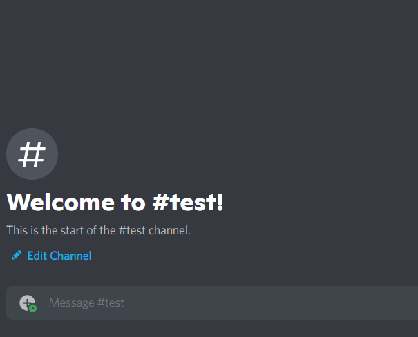

# Discord bot which replies with video to TikTok URL
### ✅ Still works fine
- [X] No TikTok watermark on videos
- [X] Supports multiple links in one message
- [X] Sends videos as reply to original message

If you encountered a problem or want some help feel free to sumbit an issue



Installation 
---
1. Make sure recent version of node.js and npm is installed on your system
2. Place your bot token in main.js
3. Run these commands
```
cd ~
git clone https://github.com/danyildiabin/tiktok-to-discord
cd tiktok-to-discord
npm install
```
Now you can start this bot
```
node main.js
```  

Autorun
---
If you're using linux you can set up `crontab` to run this bot at startup
```
crontab -e
```
Write this line to the file it opened, replacing `danyil` with your username
```
@reboot cd /home/danyil/tiktok-to-discord/ ; node main.js
```
